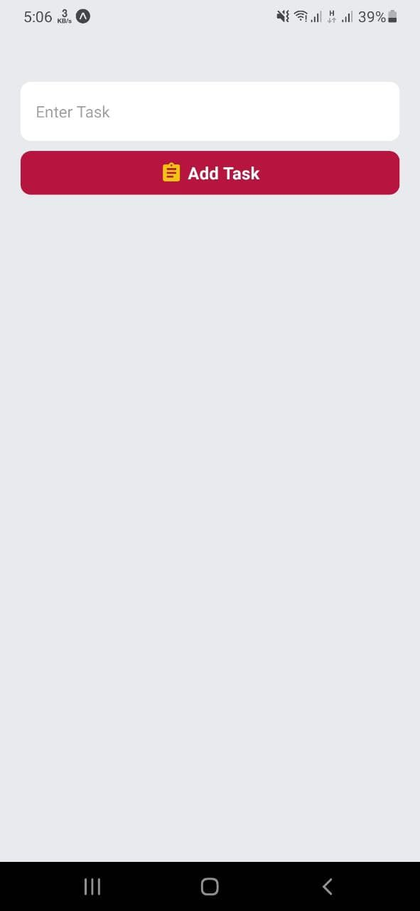
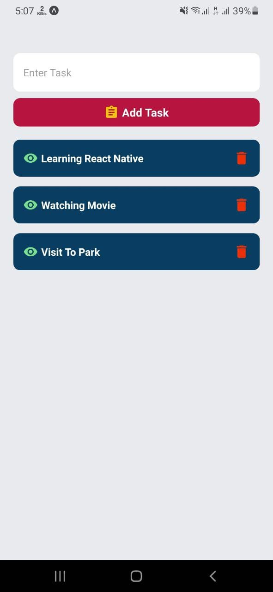
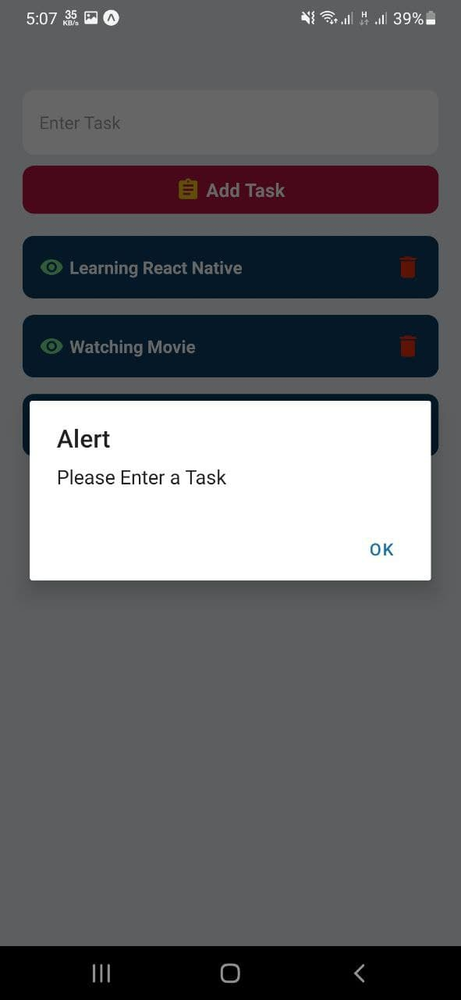

# MyTask App

### A mobile app where user can add their daily task list...

## Table of contents

- [Overview](#overview)
  - [The Features](#the-features)
  - [Technologies](#Technologies)
  - [Screenshot](#screenshot)
  - [Links](#links)
  - [What I learned](#what-i-learned)
  - [Useful resources](#useful-resources)
- [Author](#author)

---

## Overview

### The Features
- user can add task
- can delete task
- can't enter a empty task/input

### Technologies

- React Native
- React Hooks
- MaterialIcons
- Expo

### Screenshot

### Links

- Source code : [Git Repo](https://github.com/Rakibul-Islam-GitHub/MyTask-mobile-app-react-native.git)

### What I learned
I have learned the basics of react native by doing this project. React native build-in components like `Text` `View` `FlatList` `StyleSheet` `MaterialIcons` were used and explored. Error and null input value is fixed.

### Useful resources

[React Native - Doc](https://reactnative.dev/docs/) 

---

## Author

- Linkedin - [Rakibul](https://linkedin.com/in/rakibul21)